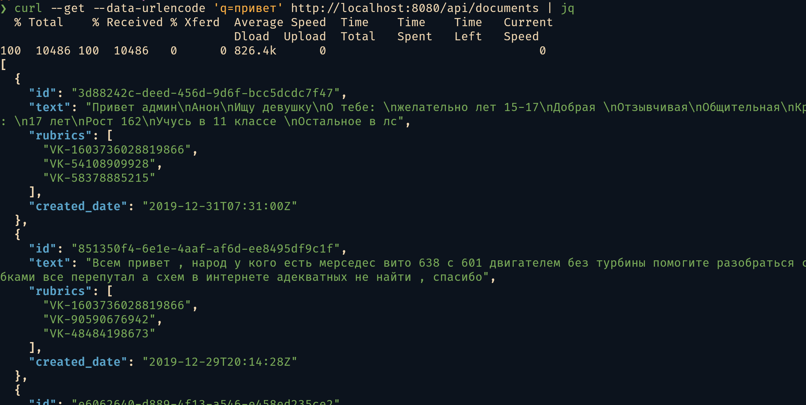
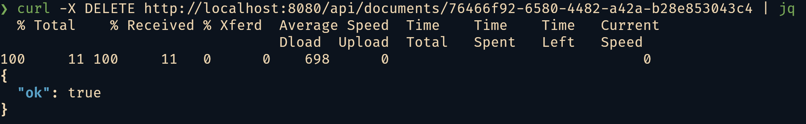

# Document Search Service

Full-text search over document texts. FastAPI + PostgreSQL + Elasticsearch.

## Quick Start

```bash
cp .env_example .env
docker compose up -d
```

The service is available at `http://localhost:8080`.  
Data-loader fills PostgreSQL and Elasticsearch with data from `data/posts.csv` on first run.

```bash
# Search
curl --get --data-urlencode 'q=привет' http://localhost:8080/api/documents 

# Delete
curl -X DELETE http://localhost:8080/api/documents/<uuid>

# Health
curl http://localhost:8080/health
```

## Demo





## API

- `GET /api/documents?q=<query>` — search top 20 documents sorted by date
- `DELETE /api/documents/{id}` — delete a document
- `GET /health` — health check
- `GET /openapi.json` — OpenAPI spec (same as `docs.json`)

## Tests

```bash
cd backend
python -m venv .venv
.venv/bin/pip install -r requirements.txt
python -m pytest -v
```

## Generate docs.json

```bash
./scripts/generate_docs.sh
```
